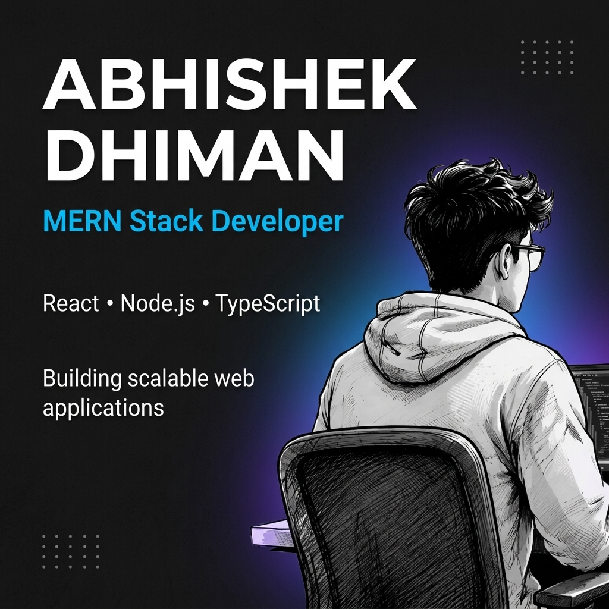

<!-- Banner -->

  

 

<!-- Animated Typing Status (Outfit Font, Adaptive Colors) -->

  <picture>
    <source media="(prefers-color-scheme: dark)" srcset="https://readme-typing-svg.demolab.com?font=Outfit&size=26&pause=1000&color=3b82f6&center=true&vCenter=true&width=780&lines=Hi%2C+I%27m+Abhishek+Dhiman+%F0%9F%91%8B;Full+Stack+Developer+%7C+MERN+%2F+Next.js;I+build+scalable+products+%26+beautiful+UIs" />
    
  </picture>

  
  
  
  

---

# Hi 👋 I'm Abhishek Dhiman

### Full Stack Developer — MERN & Next.js

I build fast, accessible, and delightful web applications using modern tools and best practices. I focus on clean UI, scalable backend architecture, and delivering production-ready features.

- 🔭 Currently: Jr. Web Developer at Veritos Infosolutions (May 2026 – Present)
- 🌱 Learning: Advanced Server-side Rendering and Performance optimizations with Next.js
- 💬 Ask me about: Authentication, RBAC, REST APIs, and building reusable UI systems

## ✨ Key Features & What I Bring

I upgraded this section to be concise, modern, and scannable. Each item highlights a real capability or outcome.

- 🚀 Fast & Scalable: Optimized React + Node apps with modular architecture and caching where appropriate.
- 🛡️ Secure by Design: JWT-based auth, role-based access control (RBAC), input validation and secure storage patterns.
- 🎨 Clean UI Systems: Reusable component libraries, Tailwind-first styling, accessible markup.
- 🔁 End-to-End Workflows: From DB schema design to CI/CD and production deployments.
- 🤝 Collaboration: Experience working with designers, PMs, and cross-functional teams to ship features.

## 🔥 Highlights (Animated & Visual)

  

  
  
  
  

---

## 🚀 Featured Projects

I've modernized the projects area so each project shows a short outcome, tech stack, and links to demo & source.

### E-Commerce Website with Admin Panel
- Tech: React, Context API, Bootstrap, JSON Server
- Highlights: Product filtering, cart, orders, admin panel, protected routes, RBAC
- Links: [Live Demo](https://github.com) • [Source](https://github.com)

### Blogify — Full Stack Blog Platform
- Tech: React, Node.js, Express, MongoDB, JWT
- Highlights: Role-based auth, publishing workflow, comments, secure APIs
- Links: [Live Demo](https://blogify-demo.vercel.app) • [Source](https://github.com)

### ChainStrap — Web & Mobile (Shared Logic)
- Tech: Next.js, React Native, Node.js, MongoDB
- Highlights: Shared business logic, consistent UI across platforms, secure APIs
- Links: [Live Demo](https://github.com) • [Source](https://github.com)

> Tip: If you'd like, I can turn these into interactive project cards (animated GIF previews) — I can add screenshots/GIFs for each project.

---

## 🛠️ Tech Stack & Tools (Modernized)

### Frontend
JavaScript (ES6+) • React • Next.js • React Native • TypeScript (in-progress) • HTML5 • CSS3 • Tailwind CSS • Bootstrap

### Backend & Databases
Node.js • Express • REST APIs • JWT • Bcrypt • Multer • MongoDB • Mongoose

### Tools
Git • GitHub • VS Code • Postman • Vercel • Netlify • Docker (basic) • Prettier • ESLint

---

## 📊 GitHub Stats

  
  

  
  

---

## 💼 Experience

### Veritos Infosolutions — Jr. Web Developer (May 2026 – Present)
- Building modern, responsive websites and internal client solutions.

### UIUX Studio — Full Stack Developer (Oct 2025 – Mar 2026)
- SSR apps with Next.js, Tailwind CSS, component systems and mobile integrations.

### Kaspro Solutions Pvt. Ltd. — MERN Stack Developer (Trainee) (Mar 2025 – Sep 2025)
- JWT auth, REST APIs, dashboard modules, MongoDB designs.

---

## 🎓 Education

- MCA — Central University of Himachal Pradesh (2022 – 2024)
- B.Sc — MCM DAV College, Kangra (2019 – 2022)

---

## 🤝 Connect

  <a href="https://portfolio-drab-gamma-xwqbb5iych.vercel.app/">🌐 Portfolio</a> &nbsp;|&nbsp;
  <a href="https://www.linkedin.com/in/dhiman-abhishek2010">💼 LinkedIn</a> &nbsp;|&nbsp;
  <a href="mailto:dhimanabhishek2001@gmail.com">📧 Email</a>

© 2026 Abhishek Dhiman • Built with ❤️ and JavaScript ⚛️

