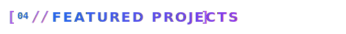
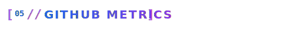

<!-- Custom Header Banner -->

  

<!-- Animated Typing Status -->

  

  <em>Delivering robust, scalable web solutions • Empowering digital transformation</em>

<!-- Social Connect Badges -->

  
  
  

<!-- Glowing Section Divider -->

  

<!-- SVG Header 01 -->

<!-- About Me Grid -->
<table>
  <tr>
    <td width="55%" valign="top">
       
      <blockquote>
        <strong>Hi! I am Abhishek Dhiman</strong>, a Full Stack Developer based in the scenic region of Kangra, India. I specialize in building responsive, feature-rich web and mobile platforms.
      </blockquote>
      

        ⚡ <strong>Core Focus:</strong> Crafting high-performance user interfaces, scaling backend systems, and establishing seamless integrations using modern frameworks.
      

      

        📚 <strong>Background:</strong> Armed with a Master of Computer Applications (MCA) degree, I combine structured computer science theory with hands-on, modern engineering.
      

      

        🌌 <strong>Philosophy:</strong> <em>"Simplicity in Code, Excellence in Delivery."</em> I aim to make codebases readable, maintainable, and highly optimized.
      

    </td>
    <td width="45%" valign="top">
       
      <pre lang="javascript">
const abhishek = {
  name: "Abhishek Dhiman",
  role: "Full Stack Developer",
  stack: ["MERN", "Next.js", "React Native"],
  hobbies: ["Tech Blogging", "Open Source"],
  motto: "Simplicity in Code, Excellence!"
};</pre>
    </td>
  </tr>
</table>

<!-- Glowing Section Divider -->

  

<!-- SVG Header 02 -->

 
 

<!-- Job Timeline using Alert Cards -->
> [!IMPORTANT]
> ### 🚀 Full Stack Developer — UIUX Studio
> *Oct 2025 – Mar 2026 | Remote*
>
> - 🌟 **Next.js SSR Integration**: Built server-side rendered applications to maximize SEO rankings and speed.
> - 📦 **Component Systems**: Developed modular, reusable design system libraries for product visual consistency.
> - ⚙️ **CMS & API Workflows**: Integrated CMS-driven dynamic workflows and managed scalable databases.
> - 📱 **Cross-Platform Apps**: Designed and deployed cross-platform mobile features using **React Native** with REST APIs.

 

> [!NOTE]
> ### 🛠️ MERN Stack Developer (Trainee) — Kaspro Solutions Pvt. Ltd.
> *Mar 2025 – Sep 2025 | Internship*
>
> - 🔒 **Authentication Systems**: Implemented JWT authentication and role-based access control (RBAC).
> - 📊 **Dashboards & APIs**: Designed backend REST APIs and built interactive dashboards using React and MongoDB.

 

### 🎓 Academic Foundation

- 🎓 **Master of Computer Applications (MCA)**  
  *Central University of Himachal Pradesh* | **2022 – 2024**  
  *Core Focus*: Software Development, Advanced Database Management Systems, Web Architectures.

- 🔬 **Bachelor of Science (B.Sc.)**  
  *MCM DAV College, Kangra, HP* | **2019 – 2022**  
  *Core Focus*: Mathematics, Physics, Computer Applications.

<!-- Glowing Section Divider -->

  

<!-- SVG Header 03 -->

<!-- Tech Stack Section -->
<table>
  <tr>
    <td width="30%" valign="middle">
      <strong>🖥️ Frontend &amp; Mobile</strong>
       
      <small>User interfaces, state systems, responsive web &amp; mobile clients</small>
    </td>
    <td width="70%">
      
    </td>
  </tr>
  <tr>
    <td width="30%" valign="middle">
      <strong>⚙️ Backend &amp; Databases</strong>
       
      <small>Server logics, secure endpoints, schemas, database systems</small>
    </td>
    <td width="70%">
      
    </td>
  </tr>
  <tr>
    <td width="30%" valign="middle">
      <strong>🧰 Tools &amp; Platforms</strong>
       
      <small>Environments, APIs, task pipelines, hosting &amp; versioning</small>
    </td>
    <td width="70%">
      
    </td>
  </tr>
</table>

<!-- Glowing Section Divider -->

  

<!-- SVG Header 04 -->

<!-- Projects Section -->
<table>
  <tr>
    <td width="50%" valign="top">
      <h4>🔗 ChainStrap — Web &amp; Mobile Application</h4>
      
<strong>Next-Gen Sync</strong>: Built a cross-platform full-stack application featuring shared business logic across a Next.js web application and React Native mobile client.

      
🔑 Secured via JWT, scaling storage with MongoDB and optimizing communication through modular REST APIs.

      

        
        
        
        
      

    </td>
    <td width="50%" valign="top">
      <h4>📝 BlogiFy — Full Stack Blog Platform</h4>
      
<strong>Content Engine</strong>: A modern blogging platform built with the MERN stack featuring user authentication, rich text editing, and real-time comments.

      
🛡️ Secure access, optimized publishing workflows, and dynamic database schemas using Express and Mongoose.

      

        
        
        
        
      

    </td>
  </tr>
  <tr>
    <td width="50%" valign="top">
      <h4>🛒 E-Commerce Dashboard</h4>
      
<strong>Modern Admin</strong>: A comprehensive admin dashboard for e-commerce management with analytics, inventory tracking, and order management.

      
🔐 Formatted with protected routes, scalable entity relationships, and real-time transactional status tracking.

      

        
        
        
        
      

    </td>
    <td width="50%" valign="top">
      <h4>☕ Cafe Website</h4>
      
<strong>Bespoke Landing</strong>: Developed a highly responsive web interface for a local boutique cafe with optimized rendering assets.

      
⚡ Employs micro-animations, clear grid structures, and optimized CSS styles for quick loading times.

      

        
        
        
      

    </td>
  </tr>
</table>

<!-- Glowing Section Divider -->

  

<!-- SVG Header 05 -->

<!-- Glowing Section Divider -->

  

<!-- Connect & Footer -->

  

  <em>"The best way to learn is to teach." — Frank Oppenheimer</em> 
  <strong>Let's build something impactful together! 🚀</strong>

