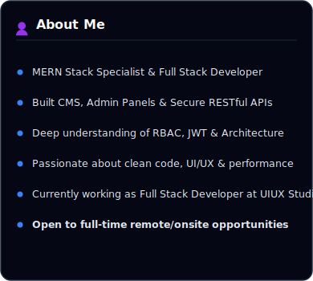
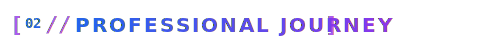
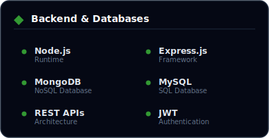
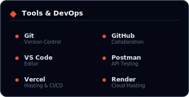
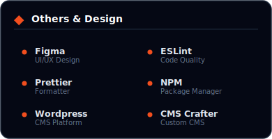
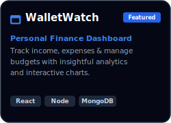
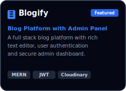
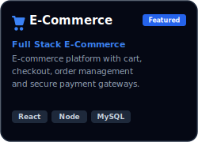
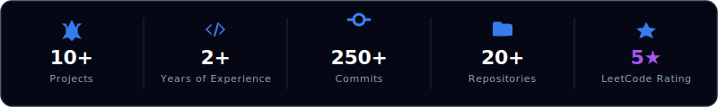

<!-- Profile Banner -->

  

 

<!-- Hero Section -->
# Hi 👋 I'm Abhishek Dhiman

### Full Stack Developer

Building modern React, Node.js & TypeScript applications.  
Passionate about clean UI, scalable backend architecture, and solving real-world business problems.

  
  
  
  

 

<!-- About Me & Journey Cards Row -->

  
  

 

<!-- Tech Stack Section -->
## 🛠️ Tech Stack & Tools

  
  

  
  

 

<!-- Featured Projects Section -->
## 🚀 Featured Projects

<table width="100%" border="0" cellpadding="0" cellspacing="10">
  <tr>
    <td width="33%" align="center" valign="top">
      
       
      

        
        &nbsp;
        
      

    </td>
    <td width="33%" align="center" valign="top">
      
       
      

        
        &nbsp;
        
      

    </td>
    <td width="33%" align="center" valign="top">
      
       
      

        
        &nbsp;
        
      

    </td>
  </tr>
</table>

 

<!-- GitHub Stats Section -->
## 📊 GitHub Stats

  

  
  

  
  

  

 

<!-- Footer -->
## 🤝 Connect With Me

Thanks for visiting! Let's build something amazing together.

  
  
  
  

  © 2026 Abhishek Dhiman • Made with ❤️ and lots of 💻

